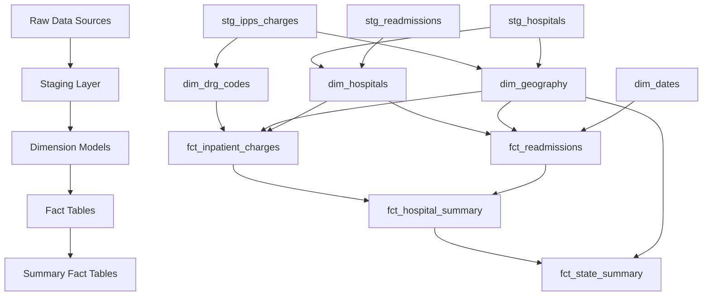
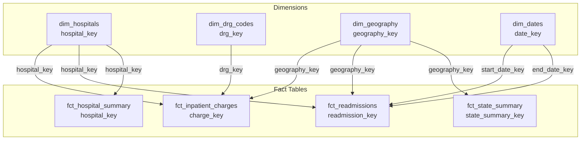

# Dimension Models - Mermaid Diagram

This file contains the Mermaid ER diagram code for the dimension models architecture.

## ER Diagram

```mermaid
erDiagram
    %% Define all entities first
    stg_hospitals {
        string facility_id
        string facility_name
    }
    
    stg_ipps_charges {
        string hospital_id
        string drg_code
        string state_abbreviation
    }
    
    stg_readmissions {
        string facility_id
        string measure_name
    }
    
    dim_hospitals {
        string hospital_key PK
        string facility_id
        string facility_name
        string address
        string city
        string state
        string zip_code
        string county
        string hospital_type
        string hospital_ownership
        string emergency_services
        integer hospital_overall_rating
        integer mort_measures_better
        integer safety_measures_better
        integer readm_measures_better
        timestamp valid_from
        timestamp valid_to
        boolean is_current
    }
    
    dim_drg_codes {
        string drg_key PK
        string drg_code
        string drg_description
        string drg_category_code
        string drg_category_description
    }
    
    dim_geography {
        string geography_key PK
        string state_abbreviation
        string state_fips_code
        string city
        string zip_code
        string county
        integer ruca_code
        string ruca_description
        string urban_rural_classification
        string census_region
        string census_division
    }
    
    dim_dates {
        date date_key PK
        date date_day
        integer year
        integer month
        integer day
        integer quarter
        string day_name
        string month_name
        integer fiscal_year
        integer fiscal_quarter
        boolean is_weekend
        boolean is_weekday
    }
    
    fct_inpatient_charges {
        string charge_key PK
        string hospital_key FK
        string drg_key FK
        string geography_key FK
        integer total_discharges
        decimal avg_covered_charges
        decimal avg_total_payment
        decimal avg_medicare_payment
        decimal markup_ratio
    }
    
    fct_readmissions {
        string readmission_key PK
        string hospital_key FK
        string geography_key FK
        date start_date_key FK
        date end_date_key FK
        integer number_of_discharges
        integer number_of_readmissions
        decimal excess_readmission_ratio
        string performance_category
    }
    
    fct_hospital_summary {
        string hospital_key PK_FK
        integer total_discharges
        decimal total_covered_charges
        decimal avg_markup_ratio
        decimal weighted_excess_ratio
    }
    
    fct_state_summary {
        string state_summary_key PK
        string state_abbreviation
        string census_region
        integer hospital_count
        decimal state_avg_covered_charges
        decimal state_avg_excess_readmission_ratio
    }
    
    %% Define relationships after entities
    stg_hospitals ||--o{ dim_hospitals : "builds"
    stg_ipps_charges ||--o{ dim_drg_codes : "extracts"
    stg_ipps_charges ||--o{ dim_geography : "extracts"
    stg_hospitals ||--o{ dim_geography : "enriches"
    
    dim_hospitals ||--o{ fct_inpatient_charges : "hospital_key"
    dim_drg_codes ||--o{ fct_inpatient_charges : "drg_key"
    dim_geography ||--o{ fct_inpatient_charges : "geography_key"
    
    dim_hospitals ||--o{ fct_readmissions : "hospital_key"
    dim_geography ||--o{ fct_readmissions : "geography_key"
    dim_dates ||--o{ fct_readmissions : "start_date_key"
    dim_dates ||--o{ fct_readmissions : "end_date_key"
    
    dim_hospitals ||--o{ fct_hospital_summary : "hospital_key"
    dim_geography ||--o{ fct_state_summary : "geography_key"
```

## Flow Diagram



## Star Schema Visualization



## Usage

To view these diagrams:

1. **GitHub/GitLab**: Mermaid diagrams render automatically in markdown files
2. **VS Code**: Install the "Markdown Preview Mermaid Support" extension
3. **Online**: Copy the code to [Mermaid Live Editor](https://mermaid.live/)
4. **dbt Docs**: If your dbt docs support Mermaid, these will render there

## Notes

- PK = Primary Key
- FK = Foreign Key
- Relationships show one-to-many (||--o{)
- All dimension tables use surrogate keys for better performance
- Fact tables reference dimensions via foreign keys

